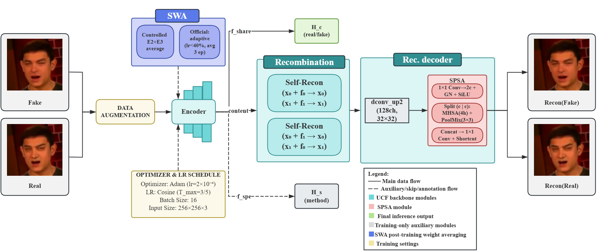

# SPSA + SWA for Cross-Domain Deepfake Detection — Reproduction Package

Code, configurations, and training logs for the paper:

> **A Superadditive Weight-Averaging Strategy with Split-Pool Self-Attention for Deepfake Detection**
> Lukun Zhang, Teng Wen, Rui Wang, Jingxin Su, and Huiyan Liu
> School of Software Engineering, Beijing Jiaotong University, Beijing, China
> *Submitted to ICASSP 2027*

---

## 👋 A note for ICASSP 2027 reviewers

Welcome — and thank you for reviewing this submission. This repository is its artifact.

**You do not need to run anything.** Reproducing the pipeline end to end takes FaceForensics++,
the four cross-domain datasets, and multi-GPU-days, and **no claim in the paper depends on it**.
The repository exists so that what *was* executed is inspectable in full.

Four pointers that may save you time:

- **[Where every claim in the paper lives](#where-every-claim-in-the-paper-lives)** — a table mapping each
  numbered claim in the paper to the logs, configs, or JSON files that carry it. Each headline
  number traces to a training log or a JSON file in this repository.
- **`scripts/verify_mechanism.py`** — a **zero-dependency, offline** re-derivation of every number in
  §3.3 and of the ResNet34 mechanism numbers in §4.6, reading only the artifacts shipped here.
  It takes a second to run and asserts the values against the paper:
  ```bash
  python scripts/verify_mechanism.py     # -> "all ... values reproduce exactly."
  ```
- **[Known caveats](#known-caveats)** — nine things that would otherwise look like
  inconsistencies. Three of them matter most: two configurations are **reconstructed** because the
  per-run YAML was not archived; the logs are **included selectively** under a stated rule; and
  **the seed coverage of the backbone table is not uniform** — §4.6's parenthetical "(all three
  controlled seeds)" is supported by EfficientNet-B4 alone.
- **[Evaluation protocol](#evaluation-protocol)** — what "7-point mean" means here, and why the
  paper reports the trajectory mean rather than the best checkpoint

Questions about the code, the protocol, or any number are very welcome.



*Fig. 2 of the paper — the full training and inference pipeline (`H_c`, the real/fake head, and
`H_s`, the method-classification head, both shown). The **SPSA** module is the red box inside the
reconstruction decoder: a 1×1 convolution expands the 128 channels, `Split(c | c)` halves them,
one branch runs multi-head self-attention (4 heads, global context) and the other PoolMix (3×3,
PoolFormer-style local pooling); the outputs are concatenated, fused by a 1×1 convolution, and
re-added via a residual shortcut. It **sits entirely inside the reconstruction decoder and never
touches the fingerprint-representation path used for classification** — 66.8K parameters, 0.14%
of the model. The blue box (top left) is the SWA collection window, drawn as the two protocols
actually used: `Controlled: E2+E3 average` and `Official: adaptive (lr < 40%, avg 3 ep)`.*

---

## What this repository is

A full reproduction package for a **negative-result-driven** study on training-time interventions
for cross-domain deepfake detection. The paper makes three points:

1. **Stochastic Weight Averaging (SWA) alone provides no consistent benefit** in short-horizon
   training: the paired gain is **−0.39** points, negative on 3/3 seeds and inside the noise
   margin (§4.2, Table 2).
2. A lightweight **Split-Pool Self-Attention (SPSA)** module — **66.8K parameters, 0.14% of the
   model** — is added to the reconstruction decoder. In controlled three-seed experiments
   **neither SPSA nor SWA helps independently** (SPSA alone **−0.38**, SWA alone **−0.39**),
   while their **combination** improves trajectory-mean AUC by **+1.27 points** (SPSA's net
   contribution on top of SWA is **+1.66**). What repeats is the **sign**: **+1.27** controlled
   (§4.2, Table 2), **+1.02** under the official six-round protocol (§4.4), each **3/3 seeds**.
   The gain also holds across **four unseen cross-domain benchmarks** (OOD mean **+1.00**,
   positive on 4/4 protocols — §4.5, Table 4), and is **backbone-dependent in magnitude, not in
   direction** (§4.6 — see caveat 8 on seed coverage).
3. **Best-checkpoint reporting is unstable** — it is sensitive to the random seed and to which
   checkpoints are sampled, and it can **reverse the sign** of a paired comparison. The paper
   therefore reports the **mean AUC along the training trajectory**.

The paper's headline claim rests on the **agreement of the sign across settings**, not on the
+2.04 interaction term — which the paper itself describes as *the arithmetic residual of the 2×2
table rather than a tested effect*.

This repository contains every configuration, training log, and evaluation artifact behind those
claims, laid out as a **single tree** (there are no experiment branches to navigate).

> 📖 **A note on language.** Every `README.md` in this repository is in English. Most documents
> under `docs/` are written in **Chinese**: they are the original lab notebooks, kept verbatim as
> the primary record. The numbers and provenance in them are authoritative; only the prose is
> Chinese. The five documents added in the 2026-09-25 completion pass — `mechanism_endpoint_position.md`,
> `r34_backbone_rerun.md`, `cross_backbone_convnext.md`, `sota_reference_table.md`,
> `config_generation_manifest.md` — are written in English for the reader.

---

## Repository layout

```
.
├── code/               Patched DeepfakeBench files — six self-contained protocol variants
├── configs/            All YAML run configurations (controlled, official, backbone, control arms)
├── config_dump/        Reference config dumps read from the header of each training log
├── logs/               Training logs — the only non-regenerable source of the 7-point trajectories
├── cross_domain/       Table 4 data: per-checkpoint metrics, evaluation script, final matrix
├── variants/           Additional controlled experiments — GaussSWA, SPSAOFF, reproduction, diagnostics
├── figures/            Plot scripts that generate the paper's figures
├── docs/               Lab notebooks: verified-data documents, experiment timeline, benchmark
├── scripts/            Chain scripts used to launch the multi-run batches, and the verifier
├── assets/             fig2_pipeline.png — the paper's Fig. 2, embedded above
└── README.md
```

| Path | Contents |
|---|---|
| `code/` | Six **self-contained** protocol variants — see below |
| `configs/` | YAML configs for every run: controlled 2×2, official protocol, backbone runs, the SAM / Lookahead / EMA arms, the mechanism rate-sweep, and the SOTA retraining batch |
| `config_dump/` | Configuration dumps parsed from the **header of each training log** — the authoritative config source, since it records what the run actually used |
| `logs/` | `ctrl_training_logs/` holds the 12 controlled runs (one directory per run); the flat `train_*.log` files are the official six-round runs; `mechanism_ucf/`, `mechanism_r34/`, `cross_bb/` and `sota/` carry the §3.3, §4.6 and §4.2-Table-1 evidence added in the 2026-09-25 completion pass. Per-checkpoint metrics live here and nowhere else |
| `cross_domain/` | Table 4 (OOD): `cross_domain_results_7points.json`, `crossdomain_final_matrix_20260831.md`, `cross_domain_eval.py` |
| `variants/` | GaussSWA, SPSAOFF, reproduction runs, and the diagnostics that established seed determinism |
| `figures/` | `plot_spike.py` (Fig. 1), `_draw_mech_two_panels.py` (Fig. 3), `plot_spsa_arch.py` (Fig. 2) and the related trajectory plots |
| `docs/` | `spsa1_ctrl_verified_data.md` (the single source of truth for the controlled metrics), `authority_7point_benchmark.md`, the per-experiment verified-data documents, the five documents added in the completion pass, and `00_实验历史时间线.md` |
| `scripts/` | Chain scripts for the multi-run batches, the SAM / Lookahead / EMA patches, the config generators, and `verify_mechanism.py` |
| `assets/` | `fig2_pipeline.png` |

### `code/` — six protocol variants

The training loop and trainer differ between protocols; everything else is shared verbatim. Rather
than ship one tree with mutually exclusive variants of `train.py`, each gets its own
**complete, runnable** directory:

| Directory | Protocol | Also contains |
|---|---|---|
| `code/controlled/` | Controlled 4-cycle (`nEpochs=3`, four cosine cycles, consistency loss off) | `ucf_detector.py.bak_spsa2` — see caveat 1 |
| `code/official-fixed/` | Official 6-round cosine, fixed two-point SWA window | |
| `code/adaptive/` | Official 6-round cosine, learning-rate-threshold adaptive window | `networks/` — the EfficientNet-B4 and ResNet-34 backbones |
| `code/alt-methods/` | Controlled protocol + SAM / Lookahead / EMA arms | `optimizor/` — the SAM and LinearLR implementations |
| `code/mechanism/` | **Instrumented** build used for the §3.3 rate sweep and the §4.6 ResNet34 mechanism legs — adds the six window probes, the mediator log and `tail_lam` | `networks/` — the **probe-hooked** ResNet34 / EfficientNet-B4, which differ from the plain copies elsewhere; `train_config.yaml` |
| `code/gauss/` | Controlled protocol with the SPSA module replaced by `GaussMix` — the module-level control of §4.2 | see caveat 9 on what `GaussMix` actually is |

The 12 files outside `train.py` / `trainer.py` are byte-identical across the four original
directories. `code/mechanism/` and `code/gauss/` are separate build snapshots and carry their own
byte-exact copies of the shared files, so each of the six directories stands alone.

---

## Where every claim in the paper lives

| Paper | Claim | Evidence in this repository |
|---|---|---|
| §3.1 | Three-seed paired protocol; one run's 7-point mean retains seed-level noise **σ_run = 0.67** points over 12 runs | `logs/ctrl_training_logs/` (12 runs), `config_dump/`, `docs/authority_7point_benchmark.md` |
| §4.2, Table 2 | Controlled 2×2: SPSA alone **−0.38**, SWA alone **−0.39**, joint **+1.27** (3/3 seeds), SPSA net **+1.66**; interaction **+2.04** (arithmetic residual, not a tested effect) | `logs/ctrl_training_logs/` (12 runs), `config_dump/`, `docs/spsa1_ctrl_verified_data.md` |
| §4.1 | Paired noise: **σ_mean = 0.74** points (df = 8), **σ_best = 1.26**; band **σ_mean/√3 = 0.43** | `docs/authority_7point_benchmark.md` |
| §4.2, Table 3 | Control arms: SAM **+0.28**, Lookahead **+0.32** (both inside the band, both flip sign), EMA **−3.37** (sign-consistent, out of band) | `docs/sam_verified_data.md`, `docs/lookahead_verified_data.md`, `docs/ema_verified_data.md`, `code/alt-methods/optimizor/` |
| §3.3, Fig. 3A | Rate sweep in weight space. Window spread: CTRL **0.79 → 7.22 → 5.07 → 8.69** pts, SPSA **1.02 → 2.66 → 3.20 → 4.28**; **Bonus positive on both arms at every rate**, Dev ≤ 0 on the module arm | `logs/mechanism_ucf/` (8 runs), `configs/mexp_p_*.yaml`, `code/mechanism/`, **re-derive with `scripts/verify_mechanism.py`** |
| §4.2 | Module-level control: `GaussMix+SWA` 7-point means **0.7098 / 0.6973**, 1.89 and 3.27 points below the same-seed SPSA+SWA runs (**0.7287 / 0.7300**) | `variants/GaussSWA/`, `code/gauss/`, `docs/spsa1_ctrl_verified_data.md` (see caveat 9) |
| §4.4 | Lr-threshold adaptive window: **+1.02**, 3/3 seeds, taking the 3-seed mean from **0.7012** (CTRL) to **0.7115** (SPSA+SWA); fixed two-point window gives **+0.71**, only **2/3 seeds positive, negative on s2048** | `logs/train_official_*_adapt.log`, `logs/train_official_cos_*.log`, `docs/adaptive_window_verified_data.md`, `docs/official_cos_verified_data.md` |
| §4.5, Table 4 | Cross-domain OOD mean **+1.00** (3/3 seeds, positive on 4/4): DFDC **+1.37**, FaceShifter **+1.53**, DeepFakeDetection **+0.14**, DFDCP **+0.94** | `cross_domain/` |
| §4.6 | Backbone sensitivity: ConvNeXt-Tiny **+0.71**, EfficientNet-B4 **+1.41**, ResNet34 **+1.71**. ResNet34 separates the two channels: module arm **Bonus = +0.07**, **Dev = −0.77**, so **Δ = +0.84**; SWA alone gives **Dev = −0.42**; across arms the module moves the paired gain by **+1.71** vs **+0.07** for SWA alone | `logs/cross_bb/`, `logs/mechanism_r34/`, `configs/cnx_*`, `configs/swv2_*`, `configs/r34_*`, `code/mechanism/networks/`, `docs/cross_backbone_convnext.md`, `docs/r34_backbone_rerun.md`, **re-derive the ResNet34 rows with `scripts/verify_mechanism.py`** — see caveat 8 on seed coverage |
| §4.2, Table 1 | Generalizable detectors retrained under our controlled protocol: Xcep **0.7085**, CORE **0.7094**, F3Net **0.7160**, SIA **0.7276**, UCF **0.7178**, Ours **0.7305** | `logs/sota/`, `configs/sota_*.yaml`, `scripts/chain_sota*.py`, `docs/sota_reference_table.md` |
| §3.2 / §4.1 | Four cycles vs six: gain **+1.27** at **22975** steps against **+1.02** at **34463** | `logs/`, `config_dump/` |
| §3, Fig. 1 | Best-checkpoint instability: SPSA+SWA peaks at **0.7708** (E2-mid) / **0.7471** (E0-end) / **0.7387** (E4-end); the best moves by **2.97 / 4.37 / 0.71** pts (mean **2.68**, beyond the ±0.43 band) while the trajectory mean moves by **1.08 / 1.52 / 0.44**; under best the sign flips and s1024 turns **−1.42** | `figures/plot_spike.py`, `docs/authority_7point_benchmark.md`, `logs/train_official_cos_*.log`, `variants/` |

---

## Evaluation protocol

All numbers are **frame-level AUC on Celeb-DF-v2**, reported as the **7-point mean** over the
training trajectory:

```
E0-end · E1-mid · E1-end · E2-mid · E2-end · E3-mid · E3-end
```

The controlled protocol uses `nEpochs=3`, which produces **four** cosine cycles (E0–E3,
`T_max=3`, consistency loss off). The official protocol uses six cosine rounds. Seeds are labeled
by their `manualSeed` value: **s1024 / s2048 / s4096** (these are seed labels, *not* image
resolutions).

### The mechanism window (§3.3)

The rate sweep opens a window over the **final cycle** and probes it six times:

```
window   steps 17232 .. 22976      probes 18182 19139 20096 21053 22010 22967
spread   max AUC - min AUC over the six probes
Dev      AUC(theta_end) - mean of the six
Bonus    AUC(theta_bar) - mean of the six
Delta    Bonus - Dev
```

`swa_eval.jsonl` stores `theta_bar` twice — once with the BatchNorm buffers re-estimated on the
training set (`bn = true`) and once with the buffers frozen from the endpoint (`bn = false`). The
two conventions differ, and the paper follows each run's own: **§3.3 (UCF) reads the `bn = true`
column**, **§4.6 (ResNet34) reads the `bn = false` column**, because that leg mirrored the
archived R34 protocol which froze the buffers. Both columns are printed by
`scripts/verify_mechanism.py`.

`tail_lam` is the learning-rate clamp inside the window, as a fraction of `lr_max = 2e-4`.
`lam = 0` leaves the schedule on its own `lr = 1e-6`, so the four rungs are **1× / 40× / 100× /
200×**.

---

## Quick start

**Environment.** AutoDL RTX 5090 32 GB, PyTorch, running a fork of
[DeepfakeBench](https://github.com/SCLBD/DeepfakeBench). Copy the protocol directory you want
from `code/` over your DeepfakeBench checkout. The backbone is **Xception**, initialized from
`xception-b5690688.pth`.

**Data.** As recorded in the log-header configuration dumps (the authoritative source):

| | |
|---|---|
| Train | **FaceForensics++** — all four manipulation subsets `FF-F2F, FF-DF, FF-FS, FF-NT`, **c23** compression |
| Test | **Celeb-DF-v2** |
| Cross-domain | DFDC, DFDCP, FaceShifter, DeepFakeDetection — symlinked into `datasets/rgb` |
| Input | pairs, 256×256, 32 frames per clip, batch size 16 |

Datasets must be obtained separately from their original providers — see the License section.

**Run.**

```bash
python train.py --detector_path configs/<config>.yaml
```

The scripts in `scripts/` chain the full multi-run batches. Each training writes a `training.log`
whose header contains a complete configuration dump — use that dump, not the YAML alone, when
reproducing a specific run.

**Verify.** No data and no GPU needed:

```bash
python scripts/verify_mechanism.py
```

---

## Known caveats

These are deliberate and load-bearing; please read before reproducing.

**1. SPSA2 is applied twice (kept intentionally).**
In `code/*/ucf_detector.py`, the forward pass contains `f_share = self.spsa2(f_share)` appearing
**twice in succession** (and the same duplication in the `__init__` block). This is the exact code
state used for all 12 controlled runs, and it is **preserved bug-for-bug**. Changing it will make
your SPSA2 numbers disagree with the paper. **SPSA1** (`spsa: true`, single application inside the
decoder) is unaffected. `code/controlled/ucf_detector.py.bak_spsa2` is kept as the byte-exact
artifact of the state this was diagnosed from.

**2. The SWA checkpoint has a deployment-form mismatch.**
The training output `swa.pth` carries a `module.` prefix and an `n_averaged` key (**617 keys**), while
`test.py` expects unprefixed weights (**616 keys**). Convert to `swa_fixed.pth` before cross-domain
evaluation — see `scripts/swa_retest_chain.sh`. The "SWA-Final" column in the tables is a
single-evaluation reference; the **primary metric is the 7-point mean**.

**3. Seed determinism required a patch.**
Deterministic behaviour across `np.random`, the dataloader workers, albumentations, and cuDNN is
handled in `code/*/train.py`. Without it, runs are not seed-reproducible. See
`docs/00_实验历史时间线.md`, stage 4.

**4. One run's intermediate checkpoints were lost.**
The reproduction run `ucf_2026-08-31-15-35-06` (controlled SPSA+SWA s2048, the 7-checkpoint weight
source for the Table 4 SPSA column) disappeared from cloud storage after 2026-08-31 and could not be
recovered. Its UCF-side trajectory is replaced by the first run of the same configuration
(`ucf_2026-08-24-09-59-38`), and its cross-domain values are frozen in
`cross_domain/cross_domain_results_7points.json` and `crossdomain_final_matrix_20260831.md`, so the
Table 4 numbers remain fully traceable. Details in `logs/ctrl_training_logs/README.md`.

**5. The documents under `docs/` predate the final paper.**
They were written during the experiments, against an earlier and longer manuscript, and still use
its table numbering (you will see references to "Table 4", "Table 5", etc. that no longer exist in
the submitted paper). Where a number in `docs/` differs from the paper, **the paper is
authoritative** — the docs preserve the analysis history, including intermediate attributions that
were later superseded by the three-seed finalization.

**6. Three configurations are reconstructed; eight correspond to runs that never happened.**
The per-run YAML files for three controlled runs were not archived. They are restored as
`configs/stat_SPSA_s1024.yaml`, `configs/stat_CTRLSWA_s4096.yaml` and
`configs/stat_SPSA1SWA_s4096.yaml`, each derived from its same-arm sibling by **changing
`manualSeed` only**, and each carrying a header that says so. The runs themselves did happen and
their logs are in `logs/ctrl_training_logs/`; the reconstruction was verified **field by field, 46
keys, zero mismatches** against each run's own configuration dump. Separately, the four files
`configs/r34_stat_{ctrl,SPSA1SWA}_resnet34_s{1024,4096}.yaml` describe seeds that were **never
run**; they exist only so the configuration set is complete, and each carries a header saying
`THIS SEED WAS NEVER RUN`. Full accounting: `docs/config_generation_manifest.md`.

**7. The logs are included selectively, under a stated rule.**
A log is shipped **iff a number it produced appears in the paper**. Two SOTA retraining logs are
therefore absent: `spsl` (0.7404) and `srm` (0.7577) were both dropped from Table 1 and appear
**zero times** in the submitted text. Their configurations (`configs/sota_spsl_*.yaml`,
`configs/sota_srm_*.yaml`) *are* shipped, along with the retraining scripts. Two mechanism runs
are likewise absent: `ucf_2026-09-16-21-34-05` (a pre-fix run whose probe log is empty) and
`ucf_2026-09-17-17-51-30` (the `l0_nz` variant, not used in the paper); so are two ResNet34 runs
that were truncated or killed. Nothing was renumbered, edited, or synthesized. A 0-byte
`logs/official_cos_sched.log` is a placeholder — the official-protocol schedule is recorded inside
each run's own `training.log` header instead.

**8. ⚠️ The seed coverage of §4.6 is not uniform.**
§4.6 states that the gain stays positive "on ConvNeXt-Tiny, EfficientNet-B4 and ResNet34, **all
three controlled seeds**". That parenthetical is supported by **EfficientNet-B4 alone** (s1024 /
s2048 / s4096 — see `docs/efnb4_3seed_verified_data.md`). The other two backbones each have a
**single controlled seed, s2048**: `configs/cnx_*_convnext_tiny_s2048.yaml` and
`configs/r34_*_resnet34_s2048.yaml` are the only such configurations in existence, and no
s1024/s4096 log for either backbone exists anywhere in the archives. `swv2_tiny` was also measured
(s2048) and did **not** gain; it is not claimed in the paper. Read §4.6's direction claim as
supported, and its three-seed qualifier as supported for EfficientNet-B4 only.

**9. `GaussMix` has no trainable parameters.**
§4.2 describes the module-level control as replacing SPSA "with Gaussian noise of **equal parameter
count**". The shipped implementation does not work that way: `code/gauss/spsa_modules.py` defines
`GaussMix` with a single scalar `amp` and **zero trainable parameters** — its forward pass returns
`x + amp * randn_like(x)` in training mode and `x` in eval mode. `amp` is calibrated
(`variants/GaussSWA/`, `scripts/` and the `gauss_amp` key in the log headers: 0.324763 for the
calibration run, then 0.1) to match the **measured standard deviation of the SPSA perturbation**
`std(spsa(x) - x)`, i.e. the noise is matched in *amplitude*, not in parameter count. A genuine
equal-parameter structural control also exists in this repository and is **not** the one behind the
0.7098 / 0.6973 numbers: `SPSAPlaceholder` (~66.6K parameters, within 0.3% of SPSA's ~66.8K),
configured by `configs/ucfx_stat_ph_xception_s2048.yaml` and
`configs/ucfx_stat_ph1swa_xception_s2048.yaml`. The control's *result* — that adding noise at the
same insertion point does not recover the gain — is unaffected; only the "equal parameter count"
description does not match this code.

---

## Citation

If you use this code or these protocols, please cite:

```bibtex
@inproceedings{zhang2027spsa,
  title     = {A Superadditive Weight-Averaging Strategy with Split-Pool
               Self-Attention for Deepfake Detection},
  author    = {Zhang, Lukun and Wen, Teng and Wang, Rui and Su, Jingxin and Liu, Huiyan},
  booktitle = {Submitted to IEEE International Conference on Acoustics,
               Speech and Signal Processing (ICASSP)},
  year      = {2027}
}
```

The entry will be updated with the proceedings details upon publication.

---

## License

Released under the **MIT License** — see [LICENSE](LICENSE).

Note that **FaceForensics++, Celeb-DF-v2, DFDC, DFDCP, and DeepFakeDetection are third-party
datasets** with their own licenses and terms of use. This repository distributes **no dataset
content**; you must obtain each dataset from its original provider.
